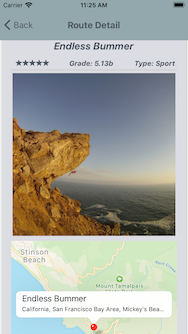

# Choss Finder




>A React Native application allowing users to find a curated list of top-rated rock climbs near their current location.

---
## Table of Contents
- [Description](#description)
- [Instructions](#instructions)
- [Resources](#resources)
- [Author Info](#author-info)

---

## Description

Choss Finder is a React Native proof-of-concept mobile application that allows users to receive a curated list of rock-climbing route recommendations based upon their current location. Future iterations will include filter options based on grade, route-type, star-rating, and location, alongside map functionality providing directions from a user's current location to the given route's location. As more features are added, different navigation methodologies will be necessary, including drawer, tabular, and nested stack navigators.

#### Technologies

- React Native
- Expo

## Instructions

Choss Finder was built using the Expo Client in order to bundle, serve, and publish the application in short-order. Therefore, in order to run the application, one will have to have Expo installed locally.

```npm install expo-cli --global```

Then, install the project's dependencies

```npm install```

In order to run the project in an iOS simulator, ensure that you have Xcode installed and then run:

```expo start --ios```

## Resources

Chossfinder was built utilizing the Mountain Project API and various other publically provided tools. If you haven't yet used it, the Mountain Project page is by far the most robust online resource for rock climbing destination and route information. Check it out at: www.mountainproject.com

## Author Info

Current Software Engineering student at Hack Reactor Galvanize in Boulder, Colorado. Open to colloborating on current/future projects, and would love to chat about anything development related!

- linkedIn - [Daniel Jordan](https://www.linkedin.com/in/danielmjordan/)
- gitHub - https://github.com/danielmjordan
